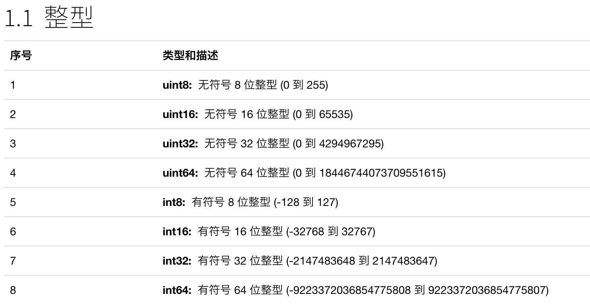
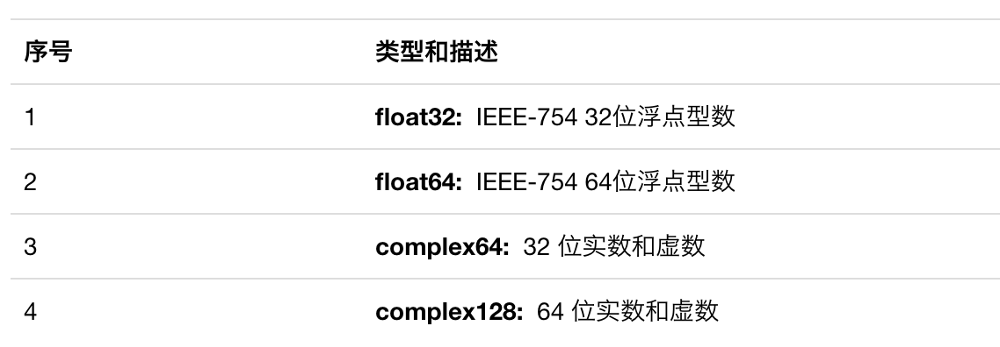
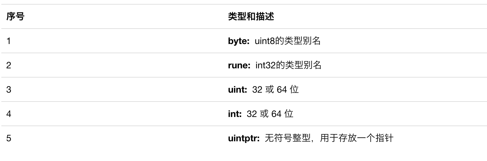

## 变量声明方式

* 先声明、后赋值
```
var name string
name = "xiaozhuanlan"
```

* 申明并且赋值
```
var name  = "xiaozhuanlan"
```

* 使用 " := " 申明并赋值
```
name := "xiaozhuanlan"
// 这里省略 var 关键字 ，效果和第二种是一样的
```

## 基本数据类型





## 条件循环

Go 语言中 if 语句的语法如下：
```
        if 布尔表达式 {
           /* 在布尔表达式为 true 时执行 */
        }
```
需要注意的是，Go 中条件语句，if 没有括号。

此外，if 还有另外一种形式，它包含一个 statement可选语句部分，该组件在条件判断之前运行。它的语法如下：
```
        if statement; condition {  

        }
```

## for循环

Go 语言只提供了 for 循环，没有 while 循环。go 虽然没有提供 while 循环，但是可以使用 for 循环实现 其他语言 while 循环的效果。Go 语言的 for 循环有 3 种形式，只有其中的一种使用分号。

* 类似其他语言，但是依然没有小括号
```
    for init; condition; post { 
    }
```

* 和其他语言 while 循环 类似，语法格式如下 ：
```
 for condition { }
    例如 ： 
            for 0 == 0 {}
            for true {}
```

* 死循环，类似 while (true){}，语法格式如下：
```
 for { }
```